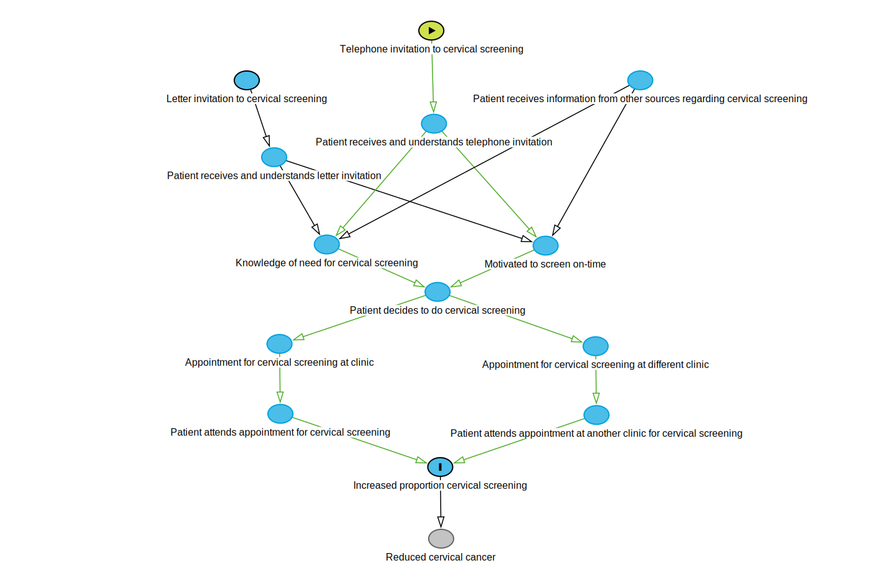

```{r prelim_setup, include=FALSE}
knitr::opts_chunk$set(echo = TRUE)
```

# Cervical screening

## Cervical screening benefits

Regular cervical cancer screening reduces the risk of cancer incidence by approximately a factor of 3 to 4 compared to no screening (for women aged 35 to 79 years), and reduces mortality by a factor of 4 to 10. Regular cervical cancer screening reduces the risk of cervical cancer incidence and death by up to a factor of two compared to irregular cervical cancer screening[^1].

[^1]:“Impact of cervical screening on cervical cancer mortality: estimation using stage-specific results from a nested case-control study” Landy, Pesola, Castanon and Sasieni. British Journal of Cancer (2016) **115**, 1140-1146

## Extent of under-screening

According to Practice Incentive program data (May 2018), 61.14% of eligible patients at coHealth Kensington were screened appropriately for cervical cancer.

Using SQL searches in the Best Practice database, as of 1st March 2019 there were 857 eligible patients who were active in seeing the clinic. Of those, 290 patients (34%) had either no recording of a cervical screening, or no cervical screening recording for the previous forty-five months. At the time of writing, cervical screening done forty-five (45) or more months previously would be the 'Pap' smear, which needs to be repeated in twenty-four (24) months.

Note : For the purpose of this document, 'eligible' patients are females aged between 25 and 75 years, who are not otherwise marked as not requiring future cervical screening. 'Active' patients refers to patients who have had three or more contacts with the clinic in the previous two years, including at least once in the previous six months. If the information is available (as it was in March 2019, but not in preceding years), the 'previous six months' contact is a 'billed visit'.

### Rate of cervical screening in patients who are underscreened

The number of active and eligible patients who either had no history of screening or were very overdue (more than 45 months old screen, when screening is due every 24 months) as of 1st March 2018 was 270 patients.

Over the next three months, fourteen of those patients (5.2%) had a recorded cervical screening.

In the next three months after that, an additional ten patients (3.7%) had a recorded cervical screening.

SQL search code used to count historical screening found at the end of this document. Note that no billing information is available prior to June 2018, so the definition of an 'active' patient is slightly different.

## Usual strategies to promote cervical screening.

During visits for other purposes in a primary care clinic, patients are, where possible, recommended to have cervical screening. This can be aided by automated 'real-time' tools such as Doctor's Control Panel, and the availability of a womens' health nurse who is available to do cervical screening.

In addition, the clinic runs a reminder system which invites patients to repeat the cervical screening when the next screening is due. This is done with a letter, in English. The government also uses letters to remind people when the next cervical screening is due. Until very recenty, the 'reminder' interval has been two years, as cervical screening was done with the 'Pap' test until 2018.

## Cervical screening outcome payment

Not available from latter half of 2019.

Current eligible practice population : 754 (according to May 2018 PIP data)

Annual outcome payment : $3 per eligible patient = $2262. Never yet received

* Current cervical screening coverage rate (according to 2017 PIP data) = 61.14%
* Target Diabetes SIP claim rate to claim annual outcome payment = 70%

Potential additional Cervical SIP revenue, if target Cervical SIP claim rate achieved, assuming that half of additionally screened women can have a cervical SIP item claimed
= (70-61.14)/100 * 754 * $35 * 0.5 =  $1169.1

Additional revenue if Cervical Outcome Payment achieved
= $2262 (annual outcome payment) + $1169.1 (additional cervical SIP revenue)
= $3431.1

# Cervical Screening and intensive telephone-based case-finding

## Methods

* Identify active eligible women who either have no recorded cervical screening or whose last recorded screening is very overdue (most recent result 45 months or older)
* One of two surveyors (Dr Buddini, or womens' health nurse) will invite the woman to participate in cervical screening. The invitation will be done by telephone, using a telephone interpreter if required.
* If the invitation is accepted, an appointment is made for cervical screening.

```{r setup, message = FALSE, results = 'hide', warning = FALSE, echo = FALSE}
library(MASS) # has its own 'select' function!
library(tidyverse)
library(dagitty)
library(lubridate)
library(openxlsx)
library(formattable)
library(kableExtra)
library(huxtable)
```


## Theory of Change graph

```{r theory-of-change, echo = FALSE}
dag <- downloadGraph("dagitty.net/mannE14")
# data for directed acyclic graph model of intervention
# graph create with dagitty at www.dagitty.net
```

```{r eval=FALSE, echo=FALSE, fig.width=12, fig.height=8}
# not needed since a more colourful SVG file is used to display the graph
plot(dag)
```



## Logical framework

-----------------------------------------------------------------------------------
Objectives    Indicator              Verification         Assumptions/Threats
Hierarchy
------------  ---------------------- ----------------     ------------------------------
(Input)       Telephone invitation   Call log             Telephone answered
Invitation
to cervical                                               
screening by                                                   
telephone        

                                                          Common language used

                                                          Social desirability bias?
                                                          e.g. type of practitioner
                                                          ringing, or previous contact
                                                          with practitioner who rings
                                                    
                                                          Diqualifying criteria
                                                          for cervical screening
                                                          e.g. hysterectomy
                                                 
(Input)       Letter invitations     Previous letter      Letter read
Invitation                           in file                                            
to cervical
screening by
mail

                                                          English literacy
                                                        
                                                          Letter persuasive
                                                 
(Output)      Appointments made      Appointment log      Appropriate cervical
Appointment                                               screening already
for cervical                                              done elsewhere
screening

                                                          Disqualifying criteria
                                                          for cervical screening
                                                          e.g. hysterectomy

              Appointments attended  Appointment book     Appointment is remembered
         
              Cervical screening     Cervical             Some cervical screening will
              (CST) at clinic        screening            be the result of the telephone
                                     results (can         invitation, others might
                                     be searched          screen for other reasons.
                                     using clinical
                                     database).
         
                                                          Cervical screening
                                                          (CST) might be
                                                          done elsewhere

(Outcome)     Improved cervical      Government
Improved      screening coverage     Practice Incentive
cervical                             Program reports
screening
coverage                            

              Increase detection     Patient record
              of HPV or cervical     audit of HPV/
              changes                pLSIL/LSIL detected
                                     (Low-grade squamous
                                     intraepithelial
                                     lesion, possible
                                     or confirmed) 
                                   
                                     HSIL detected
                                     (High-grade squamous
                                     intraepithelial
                                     lesion)

(Impact)      Reduced cervical       Difficult!           Vulnerable population
Reduce        cancer rates                                screened
cervical
cancer

--------------------------------------------------------------------------------------


## Variables to measure

* **Age**
* **Refugee or asylum seeker** Possible proxy for less English literacy skills, or different health literacy.
* **Interpreter usually required** Usually recorded in clinical notes
* **Patient seen by surveyor previously** Could effect response rate
* **Patient has had cervical screening before?**
* **Date of last recorded cervical screening**
* **Number of attempts to contact patient by telephone**
* **Patient contacted by telephone**
* **Interpreter used during telephone invitation?**
* **Patient had cervical screening done elsewhere appropriately?**
* **Patient ineligible for cervical screening** e.g. has had hysterectomy
* **Appointment made**
* **Appointment attended**
* **Cervical screening done at booked appointent as result of telephone invitation**
* **Cervical screening changes requiring review or referral**
* **Referral to gynaecologist as result of cervical screening**

## Population

```{r read-data, echo = FALSE}
population <- as_tibble(read.csv("20190301CSTpopulation.csv"))
seen_Buddini <- as_tibble(read.csv("20190301CSTBuddini.csv"))
refugeeasylum <- as_tibble(read.csv("20190301CSTRefugeeAsylum.csv"))
```

Summary

```{r convert-data, echo = FALSE}
# Calculate age
# 
# By default, calculates the typical "age in years", with a
# \code{floor} applied so that you are, e.g., 5 years old from
# 5th birthday through the day before your 6th birthday. Set
# \code{floor = FALSE} to return decimal ages, and change \code{units}
# for units other than years.
# @param dob date-of-birth, the day to start calculating age.
# @param age.day the date on which age is to be calculated.
# @param units unit to measure age in. Defaults to \code{"years"}. Passed to \link{\code{duration}}.
# @param floor boolean for whether or not to floor the result. Defaults to \code{TRUE}.
# @return Age in \code{units}. Will be an integer if \code{floor = TRUE}.
# @examples
# my.dob <- as.Date('1983-10-20')
# age(my.dob)
# age(my.dob, units = "minutes")
# age(my.dob, floor = FALSE)
# code by 'Gregor' 
# https://stackoverflow.com/questions/27096485/change-a-column-from-birth-date-to-age-in-r
# requires library 'lubridate'
age <- function(dob, age.day = today(), units = "years", floor = TRUE) {
  calc.age = interval(dob, age.day) / duration(num = 1, units = units)
  if (floor) return(as.integer(floor(calc.age)))
  return(calc.age)
}

population <- population %>%
  # add columns for whether they have seen the doctor who is making the telephone calls
  # or are of known refugee or asylum seeker background
  # (?proxy for low English language literacy)
  mutate(SeenBuddini = INTERNALID %in% seen_Buddini$INTERNALID) %>% 
  mutate(RefugeeOrAsylum = INTERNALID %in% refugeeasylum$INTERNALID) %>%
  mutate(Subgroup = case_when(
    RefugeeOrAsylum & SeenBuddini ~ "Refugee+Buddini",
    SeenBuddini ~ "Buddini",
    RefugeeOrAsylum ~ "Refugee",
    TRUE ~ "Standard"
  )) %>%
  mutate(Subgroup = as.factor(Subgroup)) %>%
  mutate(DOB = dmy(DOB)) %>% # change into standard R date
  mutate(Age = age(DOB, age.day = as.Date("2019/03/01"))) %>%
  # note that age is on 1st March 2019
  mutate(AgeGroup5 = as.factor((Age %/% 5)*5)) # 5-year age groups, labelled with minimum age


population %>%
  dplyr::select("DOB", "Age", "SeenBuddini", "RefugeeOrAsylum",
                "Subgroup", "AgeGroup5") %>%
  summary()
```

### Population overview

Number of patients at each age group, and whether they have a recorded
refugee or asylum seeker background or seen by Dr Buddini in the past
two years.

```{r overview, echo = FALSE, message = FALSE}
ggplot(population, aes(x = Age, fill=Subgroup)) +
  geom_histogram(binwidth = 5, boundary = 25)
```

Total population : `r nrow(population)`

## Power calculation

Previous proportion of under-screened patients who were screened in the three months after March 2018 was 5.2%. With a populaton of 290 patients, split between two groups, power of 0.8 and significance level of 0.05, the

```{r power-calculation, echo = FALSE, message = FALSE}
power_3month <- power.prop.test(n = nrow(population)/2,
                                p1 = 0.05185,
                                # the measured proportion with recorded cervical screen
                                # under 'control' conditions
                                power=0.8, sig.level=0.05,
                                alternative = "two.sided")

power_3month

paste("Minimum detectable effect : ", power_3month$p2 - power_3month$p1)

```

For further power calculation workings, including minimum detectable effect size at 6 months, see [the Appendix - Power Calculation Details](#power-calculation-details).


## Phase 1 and Phase 2 group allocation

Complete randomization within sub-groups defined by age (5 years groups),
of known refugee or asylum seeker background, and whether seen by 
Dr Buddini in the past two years.

Two surveyors were initially planned. One of whom was Dr Buddini.
Each of the phase 1 and phase 2 were into two sub-groups for allocation
to the surveyors.

```{r random-allocation, echo = FALSE, message = FALSE}
set.seed(215936)
# set random number seed
# chosen by time on my watch at that particular second

# balance across possible co-variants of age,
# refugee/asylum seeker and whether seen by Dr Buddini in past two years

# use 'createDataPartition' function from 'caret' library

treatment <- NULL
control <- NULL

for (i in levels(population$AgeGroup5)) {
  coinflip <- runif(1)>.5
  for (j in levels(population$Subgroup)) {
    subsection <- population[population$AgeGroup5 == i & population$Subgroup == j,]
    subsection$rank <- runif(nrow(subsection))
    if ((nrow(subsection) %% 2) == 1)
    {coinflip <- 1 - coinflip} # toggle from favouring treatment or control
    new_control <- top_n(subsection, as.integer(nrow(subsection)/2 + coinflip*.5), rank)
    new_treatment <- anti_join(subsection, new_control, by = "INTERNALID")
    control <- rbind(control, new_control)
    treatment <- rbind(treatment, new_treatment)
  }
}

```

```{r survey-team-allocation, echo = FALSE, message = FALSE}
set.seed(1603104944)

treatment1 <- NULL
treatment2 <- NULL

for (i in levels(treatment$AgeGroup5)) {
  coinflip <- runif(1)>.5
  for (j in levels(treatment$Subgroup)) {
    subsection <- treatment[treatment$AgeGroup5 == i & treatment$Subgroup == j,]
    subsection$rank <- runif(nrow(subsection))
    if ((nrow(subsection) %% 2) == 1)
    {coinflip <- 1 - coinflip} # toggle from favouring one group or another
    new_treatment1 <- top_n(subsection, as.integer(nrow(subsection)/2 + coinflip*.5), rank)
    new_treatment2 <- anti_join(subsection, new_treatment1, by = "INTERNALID")
    treatment1 <- rbind(treatment1, new_treatment1)
    treatment2 <- rbind(treatment2, new_treatment2)
  }
}

control1 <- NULL
control2 <- NULL

for (i in levels(control$AgeGroup5)) {
  coinflip <- runif(1)>.5
  for (j in levels(control$Subgroup)) {
    subsection <- control[control$AgeGroup5 == i & control$Subgroup == j,]
    subsection$rank <- runif(nrow(subsection))
    if ((nrow(subsection) %% 2) == 1)
    {coinflip <- 1 - coinflip} # toggle from favouring one group or another
    new_control1 <- top_n(subsection, as.integer(nrow(subsection)/2 + coinflip*.5), rank)
    new_control2 <- anti_join(subsection, new_control1, by = "INTERNALID")
    control1 <- rbind(control1, new_control1)
    control2 <- rbind(control2, new_control2)
  }
}
```

```{r excel-export, message = FALSE, echo = FALSE, eval = FALSE}
# set {r eval = FALSE when 'knitting' to form a HTML file}
# as identifying data should not be in a public space!

patient_details <- read.csv("20190301CSTpopulation_details.csv")
# file with patient details
patient_details <- patient_details %>%
  select(c("INTERNALID", "SURNAME", "FIRSTNAME", "MIDDLENAME", "PREFERREDNAME", "TITLE", "DOB", "AGE", "RECORDNO"))
# select columns required for export

treatment1_details <- treatment1 %>%
  select(c("INTERNALID", "AgeGroup5")) %>% 
  # will store AgeGroup5 groups in separate sheets
  left_join(patient_details, by = "INTERNALID")

treatment2_details <- treatment2 %>%
  select(c("INTERNALID", "AgeGroup5")) %>% 
  # will store AgeGroup5 groups treatment in separate sheets
  left_join(patient_details, by = "INTERNALID")

control1_details <- control1 %>%
  select(c("INTERNALID", "AgeGroup5")) %>% 
  # will store AgeGroup5 groups in separate sheets
  left_join(patient_details, by = "INTERNALID")

control2_details <- control2 %>%
  select(c("INTERNALID", "AgeGroup5")) %>% 
  # will store AgeGroup5 groups in separate sheets
  left_join(patient_details, by = "INTERNALID")

wb_treat <- createWorkbook() # create blank workbook

for (i in levels(treatment1_details$AgeGroup5)) {
  subsection1 <- treatment1_details[treatment1_details$AgeGroup5 == i,]
  sheetname1 <- paste("Phase 1 Group 1 - ", i)
  addWorksheet(wb_treat, sheetname1)
  writeData(wb_treat, sheetname1, subsection1)
  subsection2 <- treatment2_details[treatment2_details$AgeGroup5 == i,]
  sheetname2 <- paste("Phase 1 Group 2 - ", i)
  addWorksheet(wb_treat, sheetname2)
  writeData(wb_treat, sheetname2, subsection2)
}

saveWorkbook(wb_treat, file = "20190301CSTPhase1Groups.xlsx", overwrite = TRUE)

wb_control <- createWorkbook() # create blank workbook

for (i in levels(control1_details$AgeGroup5)) {
  subsection1 <- control1_details[control1_details$AgeGroup5 == i,]
  sheetname1 <- paste("Phase 2 Group 1 - ", i)
  addWorksheet(wb_control, sheetname1)
  writeData(wb_control, sheetname1, subsection1)
  subsection2 <- control2_details[control2_details$AgeGroup5 == i,]
  sheetname2 <- paste("Phase 2 Group 2 - ", i)
  addWorksheet(wb_control, sheetname2)
  writeData(wb_control, sheetname2, subsection2)
}

saveWorkbook(wb_control, file = "20190301CSTPhase2Groups.xlsx", overwrite = TRUE)
```

# Results

Telephone-based recall for cervical screening commenced 1st April 2019. The results shown in the table below are interim results as of 14th November 2019. ‘n’ represents the number of patients in each sub-group. ‘CST done’ indicates that, as of 14th November 2019, a cervical screening test had been recorded within the previous two years. ‘CST overdue’ indicates that no cervical screening had been recorded during the previous two years.

‘Refugee’ is the subset of patients who have a recorded entry of ‘refugee’ or ‘asylum-seeker’ in the patient file. ‘Other’ is the remainder, who have no recorded entry of ‘refugee’ or ‘asylum-seeker’ in the patient file.

```{r results, echo = FALSE, message = FALSE}
# reads results and processes

xl1_name <- '20190401CSTPhase1Groups_results_20191114.xlsx' # results held in these XLSX spreadsheets
xl2_name <- '20190401CSTPhase2Groups_results_20191114.xlsx'

sheet_names <- getSheetNames(xl1_name) # not actually used

# the phase 1 groups who have been contacted as of 14th November 2019
id1_1_25 <- read.xlsx(xl1_name, sheet = "Phase 1 Group 1 -  25") %>%
  pull(INTERNALID)
id1_2_25 <- read.xlsx(xl1_name, sheet = "Phase 1 Group 2 -  25") %>%
  pull(INTERNALID)
id1_2_30 <- read.xlsx(xl1_name, sheet = "Phase 1 Group 2 -  30") %>%
  pull(INTERNALID)
id1_2_35 <- read.xlsx(xl1_name, sheet = "Phase 1 Group 2 -  35") %>%
  pull(INTERNALID)

id1b <- c(id1_2_25, id1_2_30, id1_2_35) # 'phase1' group contact by BE
id1 <- c(id1_1_25, id1b) # total phase 1 group contacted

# the comparison phase 2 groups (aged 25-40), not contacted by telephone
id2_1_25 <- read.xlsx(xl2_name, sheet = "Phase 2 Group 1 -  25") %>%
  pull(INTERNALID)
id2_1_30 <- read.xlsx(xl2_name, sheet = "Phase 2 Group 1 -  30") %>%
  pull(INTERNALID)
id2_1_35 <- read.xlsx(xl2_name, sheet = "Phase 2 Group 1 -  35") %>%
  pull(INTERNALID)
id2_2_25 <- read.xlsx(xl2_name, sheet = "Phase 2 Group 2 -  25") %>%
  pull(INTERNALID)
id2_2_30 <- read.xlsx(xl2_name, sheet = "Phase 2 Group 2 -  30") %>%
  pull(INTERNALID)
id2_2_35 <- read.xlsx(xl2_name, sheet = "Phase 2 Group 2 -  35") %>%
  pull(INTERNALID)

# equivalent phase 2 group
id2 <- c(id2_1_25, id2_2_25, id2_1_30, id2_2_30, id2_1_35, id2_2_35)

# all the IDs in the phase 1 (contacted) and phase 2 (not contacted)
id <- c(id1, id2)
df <- data.frame(InternalID = id)

df <- df %>%
  mutate(Phase = InternalID %in% id1) # Phase is 'TRUE' if Phase 1

# as of 14th November 2019, the CSV list of those with no CST
# in the past two years (2 years ago, the CST was 'Pap', which
# is due in two years)
noCST1 <- read.csv("TelephoneCST_Phase1_NoCST.csv")
noCST2 <- read.csv("TelephoneCST_Phase2_NoCST.csv")

noCST1_id <- noCST1 %>% pull(INTERNALID) # just get the IDs
noCST2_id <- noCST2 %>% pull(INTERNALID)
noCST_ID <- c(noCST1_id, noCST2_id) # combine the IDs

df <- df %>%
  mutate(CST = !(InternalID %in% noCST_ID))
# CST is TRUE if 'not' in the 'no CST' list

seenby_Buddini <- read.csv("20190401CSTBuddini.csv")
seenby_Buddini_id <- seenby_Buddini %>% pull(INTERNALID)

df <- df %>%
  mutate(Group2 = InternalID %in% id1b,
         Buddini = InternalID %in% seenby_Buddini_id)
# currently 'Group2' are those contacted by BE
# currently 'Buddini' are those who have previously been seen by BE

refugee_asylum <- read.csv("20190401CSTRefugeeAsylum.csv")
refugee_asylum_id <- refugee_asylum %>% pull(INTERNALID)

df <- df %>%
  mutate(refugee = InternalID %in% refugee_asylum_id)
# those listed as asylum or refugee status

df_tab <- data.frame(CSTfalse = numeric(), CSTtrue = numeric())

a <- by(df$CST, df$CST, length) # both refugee and non-refugee groups, in both phases
df_tab <- rbind(df_tab, n = data.frame(CSTfalse = a[1], CSTtrue = a[2]))
a <- by(subset(df$CST, df$Phase), subset(df$CST, df$Phase), length) # phase 1
df_tab <- rbind(df_tab, Phase1 = data.frame(CSTfalse = a[1], CSTtrue = a[2]))
a <- by(subset(df$CST, !df$Phase), subset(df$CST, !df$Phase), length) #phase 2
df_tab <- rbind(df_tab, Phase2 = data.frame(CSTfalse = a[1], CSTtrue = a[2]))

a <- by(subset(df$CST, df$refugee), subset(df$CST, df$refugee), length) # refugee subset
df_tab <- rbind(df_tab, `n ` = data.frame(CSTfalse = a[1], CSTtrue = a[2])) 
# extra space avoids duplicate rowname problem
a <- by(subset(df$CST, df$refugee & df$Phase), subset(df$CST, df$refugee & df$Phase), length)
df_tab <- rbind(df_tab, `Phase1 ` = data.frame(CSTfalse = a[1], CSTtrue = a[2]))
a <- by(subset(df$CST, df$refugee & !df$Phase), subset(df$CST, df$refugee & !df$Phase), length)
df_tab <- rbind(df_tab, `Phase2 `= data.frame(CSTfalse = a[1], CSTtrue = a[2]))

a <- by(subset(df$CST, !df$refugee), subset(df$CST, !df$refugee), length) # non-refugee subset
df_tab <- rbind(df_tab, `n  ` = data.frame(CSTfalse = a[1], CSTtrue = a[2]))
a <- by(subset(df$CST, !df$refugee & df$Phase), subset(df$CST, !df$refugee & df$Phase), length)
df_tab <- rbind(df_tab, `Phase1  ` = data.frame(CSTfalse = a[1], CSTtrue = a[2]))
a <- by(subset(df$CST, !df$refugee & !df$Phase), subset(df$CST, !df$refugee & !df$Phase), length)
df_tab <- rbind(df_tab, `Phase2  ` = data.frame(CSTfalse = a[1], CSTtrue = a[2]))

df_tab$CSTfalseProp <- df_tab$CSTfalse/(df_tab$CSTfalse+df_tab$CSTtrue)
df_tab$CSTtrueProp <- df_tab$CSTtrue/(df_tab$CSTfalse+df_tab$CSTtrue)

df_tab <- df_tab[, c("CSTfalse", "CSTfalseProp", "CSTtrue", "CSTtrueProp")]
```


```{r results-table, echo = FALSE, message = FALSE}
df_tab %>%
  mutate(Group = row.names(.),
         CSTfalseProp = color_tile("#DeF7E9", "#71CA97")(percent(CSTfalseProp, 1)),
         CSTtrueProp= color_tile("#DeF7E9", "#71CA97")(percent(CSTtrueProp, 1))) %>%
  dplyr::select(Group, everything()) %>%
  kable("html", escape = F,
        col.names = c(" ", "n", "%", "n", "%"))  %>%
  kable_styling("striped", full_width = F) %>%
  column_spec(1, width = "10em") %>%
  row_spec(0, align = "c") %>%
  add_header_above(c(" " = 1, "CST overdue" = 2, "CST done" = 2)) %>%
  pack_rows("All", 1, 3) %>%
  pack_rows("Refugee", 4, 6) %>%
  pack_rows("Other", 7, 9)

```

As of 14th November 19, patients aged 25 to 39 years had been contacted by telephone. A
total of thirty-six (36) patients are in the sub-groups (in ‘Phase 1’) for which telephone
contact had been attempted. Of these ‘Phase 1’ patients, ten (27.8%) had a recorded
cervical screening test within the previous two years as of 14th November 2019.

These ‘Phase 1’ groups are compared with patients in the same age range (25 to 39 years)
who are in the ‘Phase 2’ group which have not yet been contacted by telephone for cervical
screening. A total of forty-seven (47) patients are in this group. Of these ‘Phase 2’ patients,
four (8.5%) had a recorded screening test within the previous two years as of 14th
November 2019.

Telephone-based recall for cervical screening has a positive effect on cervical screening
rates for patients who are overdue for cervical screening.

The table above suggests that, although patients with a background of refugee/asylumseeker status have a very low rate of cervical screening compared to non-refugee patients (‘Refugee Phase 2’ vs. ‘Other’ Phase 2), the rate of cervical screening is similar if
telephone-based recall for cervical screening is done (‘Refugee Phase 1’ vs. ‘Other’ Phase 1).

This is also shown visually in the ‘interaction plot’ below.

```{r results-interaction, echo = FALSE, message = FALSE, warning=FALSE}
interaction.plot(df$Phase, df$refugee, df$CST,
                 trace.label = "Refugee",
                 xlab = "Telephone recall",
                 ylab = "Cervical Screening up-to-date (proportion)")
```

The regression table below compares a logistic regression model which includes a
background of refugee/asylum-seeker status and interaction effects with telephone-based
recall (‘PhaseTRUE’ in the regression table below) with a simpler logistic regression model
(‘Simple model’) which just includes telephone-based recall as the predictor.

```{r aic, echo = FALSE, message = FALSE, warning = FALSE}
model1 <- glm(CST ~ refugee * Phase, family = binomial(link = "logit"), data = df)
model2 <- stepAIC(model1, trace = FALSE)
# the 'best' model, combining explanatory power and simplicity, accord ing to the
# stepwise Akaiki Information Criterion (AIC) selection
huxreg("Refugee model" = model1, "Simple model" = model2)
```

The ‘refugee model’ is not superior to the ‘simple model’ according to step-wise model
selection by Akaike Information Criterion (AIC). Step-wise model selection by AIC on the
‘refugee model’ yields the ‘simple model’.
The ‘simple model’, with just the telephone-based recall intervention (‘Phase’, indicating
‘Phase 1’), shows that there is a significant increase in cervical screening (\(p = 0.027\))
when telephone-based recall was used.

# Appendix A - SQL code

## Finding patients eligible for the study - SQL code

Find eligible patients (female, age criteria), who are active patients (defined
by three or more contacts in the past two years, including one *billed* visit in
the past six months), who have not had cervical screening detected found in the
PapSmear table or the Investigations table.

Note that there is another table 'ObGyn' which should contain the most recent
cervical screening result, but unfortunately, 'over-chose' 5 patients (found 295
patients, instead of '290' as found using this search.)

```{sql eval = FALSE}
SELECT *

FROM BPS_Patients
WHERE StatusText = 'Active'
AND Sex = 'Female'
AND DOB BETWEEN  DateAdd(Year,-75,'20190301') AND DateAdd(Year,-25,'20190301')

AND InternalID IN (SELECT InternalID
FROM Visits v
INNER JOIN (VALUES('%bhagwat%'),('%fong%'),('%ekanayake%'),('%shoesmith%'),
('%plastow%'),('%samarawickrama%'),('%obeyesekere%'),('%chaves%'),
('%ryan%'),('%mikhail%'),('%haynes%'),('%buckwell%'),('%maxwell%'),
('%grace ho%'))
AS ProviderName(Name)
ON v.DrName LIKE ProviderName.Name

WHERE VisitDate BETWEEN DateAdd(Year,-2,'20190301') AND '20190301'
AND RecordStatus = 1

GROUP BY internalid
HAVING count(internalid) >= 3)

AND InternalID IN (SELECT InternalID
FROM Invoices WHERE InvoiceID IN (SELECT InvoiceID
FROM Services
WHERE Recordstatus = 1
AND Servicedate > DateAdd(Month, -6, '20190301'))) 

AND InternalID NOT IN (SELECT InternalID
FROM PapSmears
WHERE PapDate > DATEADD(Month, -45, '20190301')
-- CST not extremely overdue (>45 months old)
)
AND InternalID NOT IN (SELECT InternalID
FROM Investigations
WHERE (
TestName LIKE '%CERVICAL SCREENING%'
OR TestName LIKE '%PAP SMEAR%')
AND ReportDate >  DATEADD(Month, -45, '20190301')
-- alternative search for Cervical Screening in Investigations (does not always appear in PAP table)
)
AND InternalID NOT IN (SELECT InternalID
FROM ObsGynDetail
WHERE NoPap=1
-- for some reason, Pap/CST marked as no longer required
)

ORDER BY surname, firstname

```

### Additional code to detect if recorded history of refugee or asylum seeker status

```{sql eval = FALSE}
AND (
InternalID IN
(SELECT InternalID FROM PastHistory WHERE ItemCode = 13155 AND RecordStatus = 1)
OR 
InternalID IN 
(SELECT InternalID FROM PastHistory WHERE ItemCode = 13154 AND RecordStatus = 1)
)
```

### Additional code to detect if contacted by a specific clinician (Dr Buddini).

```{sql eval = FALSE}
AND InternalID IN (SELECT InternalID
FROM Visits v
INNER JOIN (VALUES('%ekanayake%'))
AS ProviderName(Name)
ON v.DrName LIKE ProviderName.Name
WHERE VisitDate BETWEEN DateAdd(Year,-2,'20190301') AND '20190301'
AND RecordStatus = 1

GROUP BY internalid
HAVING count(internalid) >= 1)
```

## Historical cervical screening rates among the under-screened - SQL code

Code finds 'active' patients (5 contacts in two years, include one
contact within the previous six months) preceding 1st March 2018. Excludes
patients who are marked for 'no cervical screening'.

The 'recent' visit definition is different to seeking patients
eligible for the study, because no billing data is available prior to 
June 2018.

Further restriction to patients who had a cervical
screening test in the next three months.

```{sql eval = FALSE}
SELECT *

FROM BPS_Patients
WHERE StatusText = 'Active'
AND Sex = 'Female'
AND DOB BETWEEN  DateAdd(Year,-75,'20180301') AND DateAdd(Year,-25,'20180301')

AND InternalID IN (SELECT InternalID
FROM Visits v
INNER JOIN (VALUES('%bhagwat%'),('%fong%'),('%ekanayake%'),('%shoesmith%'),
('%plastow%'),('%samarawickrama%'),('%obeyesekere%'),('%chaves%'),
('%ryan%'),('%mikhail%'),('%haynes%'),('%buckwell%'),('%maxwell%'),
('%grace ho%'))
AS ProviderName(Name)
ON v.DrName LIKE ProviderName.Name

WHERE VisitDate BETWEEN DateAdd(Year,-2,'20180301') AND '20180301'
AND RecordStatus = 1

GROUP BY internalid
HAVING count(internalid) >= 3)

AND InternalID IN (SELECT InternalID
FROM Visits v
INNER JOIN (VALUES('%bhagwat%'),('%fong%'),('%ekanayake%'),('%shoesmith%'),
('%plastow%'),('%samarawickrama%'),('%obeyesekere%'),('%chaves%'),
('%ryan%'),('%mikhail%'),('%haynes%'),('%buckwell%'),('%maxwell%'),
('%grace ho%'))
AS ProviderName(Name)
ON v.DrName LIKE ProviderName.Name

WHERE VisitDate BETWEEN DateAdd(Month,-6,'20180301') AND '20180301'
AND RecordStatus = 1

GROUP BY internalid
HAVING count(internalid) >= 1)

AND InternalID NOT IN (SELECT InternalID
FROM PapSmears
WHERE PapDate > DATEADD(Month, -45, '20180301')
AND PapDate < '20180301'
-- CST not extremely overdue (>45 months old)
)
AND InternalID NOT IN (SELECT InternalID
FROM Investigations
WHERE (
TestName LIKE '%CERVICAL SCREENING%'
OR TestName LIKE '%PAP SMEAR%')
AND ReportDate >  DATEADD(Month, -45, '20180301')
AND ReportDate <  '20180301'

-- alternative search for Cervical Screening in Investigations (does not always appear in PAP table)
)
AND (InternalID IN (SELECT InternalID
FROM PapSmears
WHERE PapDate >= '20180301'
AND PapDate < DATEADD(Month, 3, '20180301')
-- CST done in next three months
)
OR InternalID IN (SELECT InternalID
FROM Investigations
WHERE (
TestName LIKE '%CERVICAL SCREENING%'
OR TestName LIKE '%PAP SMEAR%')
AND ReportDate >  '20180301'
AND ReportDate <  DATEADD(Month, 3, '20180301')

-- alternative search for Cervical Screening in Investigations (does not always appear in PAP table)
))
AND InternalID NOT IN (SELECT InternalID
FROM ObsGynDetail
WHERE NoPap=1
-- for some reason, Pap/CST marked as no longer required
)

ORDER BY surname, firstname
```

# Appendix B - R Code to read data, generate subgroups and analyze data

## Setup

```{r allcode, ref.label = c("setup"), echo = TRUE, eval = FALSE}
```

## Theory of change graph

```{r allcode, ref.label = c("theory-of-change"), echo = TRUE, eval = FALSE}
```

## Read and convert data

```{r allcode, ref.label = c("read-data", "convert-data", "overview"), echo = TRUE, eval = FALSE}
```

## Power calculation details {#power-calculation-details}

Previous proportion of under-screened patients who were screened in the three months after March 2018 was 5.2%. With a populaton of 290 patients, split between two groups, power of 0.8 and significance level of 0.05, the

```{r allcode, ref.label = c("power-calculation"), echo = TRUE, eval = FALSE}
```

This is similar to estimated minimum detectable effect size using the equation:

$EffectSize = (t_{1-\kappa}+t_\alpha)*\sqrt{\frac{1}{P(1-P)}}*\sqrt{\frac{\sigma^2}{N}}$

where $t_{1-\kappa}$ is the power, $t_\alpha$ is the significance level, $P$ is the proportion in treatment, $\sigma^2$ is the variance and $N$ is the sample size.

```{r echo = TRUE}
p1 <- 0.05185      # our previously observed proportion of women
# who had cervical screening (CST) over three months
p2 <- 0.1507374    # our 'guess' of what the 'treatment' group who had CST over
# three months. this guess was actually informed by
# above power calculation, however!
p_avg <- (p1+p2)/2 # the average proportion of women who might
# have cervical screening at the end of the study
# variance of binomial is p(1-p)

abs(qnorm(0.8)+qnorm(0.975))*sqrt(1/((0.5)*(1-0.5)))*sqrt((p_avg)*(1-p_avg)/290)
```

Previous proportion of under-screened patients who were screened in the six months after March 2018 was 8.9%. With a populaton of 290 patients, split between two groups, power of 0.8 and significance level of 0.05:

```{r}
power_6month <- power.prop.test(n = nrow(population)/2,
                                p1 = 0.08889,
                                # the measured proportion with recorded cervical screen
                                # under 'control' conditions
                                power=0.8, sig.level=0.05,
                                alternative = "two.sided")

power_6month

paste("Minimum detectable effect : ", power_6month$p2 - power_6month$p1)
```

## Randomized allocation

```{r allcode, ref.label = c("allocation", "phase1-group-characteristics", "phase2-group-characteristics"), echo = TRUE, eval = FALSE}
```

### Phase 1 group characteristics

```{r phase1-group-characteristics, echo = TRUE, message = FALSE}
ggplot(treatment, aes(x = Age, fill=Subgroup)) +
  geom_histogram(binwidth = 5, boundary = 24.95)
```

### Phase 2 group characteristics

```{r phase2-group-characteristics, echo = TRUE, message = FALSE}
ggplot(control, aes(x = Age, fill=Subgroup)) +
  geom_histogram(binwidth = 5, boundary = 24.95)
```

## Survey team allocation

```{r allcode, ref.label = c("survey-team-allocation"), echo = TRUE, eval = FALSE}
```

Phase 1, group 1

```{r eval = FALSE}
ggplot(treatment1, aes(x = Age, fill=Subgroup)) +
  geom_histogram(binwidth = 5, boundary = 24.95)
```

Phase 1, group 2

```{r eval = FALSE}
ggplot(treatment2, aes(x = Age, fill=Subgroup)) +
  geom_histogram(binwidth = 5, boundary = 24.95)
```

Phase 2, group 1

```{r eval = FALSE}
ggplot(control1, aes(x = Age, fill=Subgroup)) +
  geom_histogram(binwidth = 5, boundary = 24.95)
```

Phase 2, group 2

```{r eval = FALSE}
ggplot(control2, aes(x = Age, fill=Subgroup)) +
  geom_histogram(binwidth = 5, boundary = 24.95)
```

## Export sub-groups to Excel file for surveyor use.

Re-attach patient names and demographic details to
sub-groups, and export to Excel file (Phase 1 = Treat, Phase 2 = Control) for use by
surveyors.

```{r allcode, ref.label = c("excel-export"), echo = TRUE, eval = FALSE}
```

## Results

```{r allcode, ref.label = c("results", "results-table", "results-interaction", "aic"), echo = TRUE, eval = FALSE}
```
