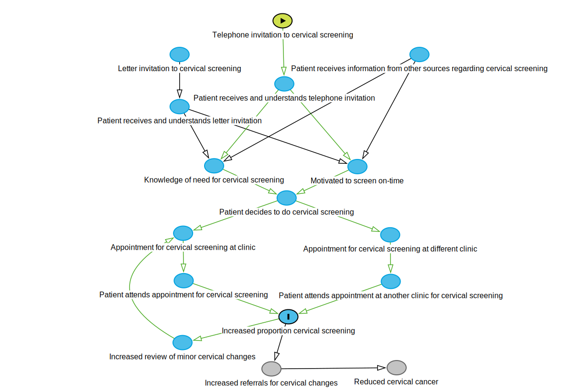

```{r setup, include=FALSE}
knitr::opts_chunk$set(echo = TRUE)
```

## Cervical screening benefits

Regular cervical cancer screening reduces the risk of cancer incidence by approximately a factor of 3 to 4 compared to no screening (for women aged 35 to 79 years), and reduces mortality by a factor of 4 to 10. Regular cervical cancer screening reduces the risk of cervical cancer incidence and death by up to a factor of two compared to irregular cervical cancer screening[^1].

[^1]:“Impact of cervical screening on cervical cancer mortality: estimation using stage-specific results from a nested case-control study” Landy, Pesola, Castanon and Sasieni. British Journal of Cancer (2016) **115**, 1140-1146

## Cervical screening outcome payment

Current eligible practice population : 754 (according to May 2018 PIP data)

Annual outcome payment : $3 per eligible patient = $2262. Never yet received

* Current cervical screening coverage rate (according to 2017 PIP data) = 61.14%
* Target Diabetes SIP claim rate to claim annual outcome payment = 70%

Potential additional Cervical SIP revenue, if target Cervical SIP claim rate achieved, assuming that half of additionally screened women can have a cervical SIP item claimed
= (70-61.14)/100 * 754 * $35 * 0.5 =  $1169.1

Additional revenue if Cervical Outcome Payment achieved
= $2262 (annual outcome payment) + $1169.1 (additional cervical SIP revenue)
= $3431.1

# Cervical Screening and intensive telephone-based case-finding

```{r message = FALSE, results = 'hide', warning = FALSE}
library(tidyverse)
library(dagitty)
library(caret)
library(lubridate)
```


## Theory of Change graph

```{r}
dag <- downloadGraph("dagitty.net/mannE14") # data for directed acyclic graph model of intervention

```

```{r eval=FALSE, echo=FALSE, fig.width=12, fig.height=8}
# not needed since a more colourful SVG file is used to display the graph
plot(dag)
```



## Logframe

-----------------------------------------------------------------------------------
Objectives  Indicator              Verification         Assumptions/Threats
Hierarchy
----------  ---------------------- ----------------     ---------------------------
Inputs      Telephone invitation   Call log             Telephone answered

                                                        Common language used
                                                   
                                                        Social desirability bias?
                                                        e.g. type of practitioner
                                                        ringing, or previous contact
                                                        with practitioner who rings
                                                    
                                                        Diqualifying criteria
                                                        for cervical screening
                                                        e.g. hysterectomy
                                                 
            Letter invitation      Previous letter      Letter read
                                   in file                                            
                                           
                                                        English literacy
                                                        
                                                        Letter persuasive
                                                 
Outputs     Appointments made      Appointment log      Appropriate cervical
                                                        screening already
                                                        done elsewhere
                                                        
                                                        Disqualifying criteria
                                                        for cervical screening
                                                        e.g. hysterectomy

            Appointments attended  Appointment book     Appointment is remembered
         
            Cervical screening     Cervical
            (CST) at clinic        screening
                                   results
         
            Cervical screening
            (CST) done elsewhere

Outcome     Improved cervical      Government
            screening coverage     Practice Incentive
                                   Program reports
                                   (PIP statements)
                                
Impact      Reduced cervical       HPV detected         Vulnerable population
            cancer rates                                screened

                                   pLSIL/LSIL detected
                                   (Low-grade squamous
                                   intraepithelial
                                   lesion, possible
                                   or confirmed)
                                   
                                   HSIL detected
                                   (High-grade squamous
                                   intraepithelial
                                   lesion)

-----------------------------------------------------------------------------------


## Read Data

```{r}
population <- as_tibble(read.csv("20190301CSTpopulation.csv"))
seen_Buddini <- as_tibble(read.csv("20190301CSTBuddini.csv"))
refugeeasylum <- as_tibble(read.csv("20190301CSTRefugeeAsylum.csv"))
```

## Convert data
```{r}
#' Calculate age
#' 
#' By default, calculates the typical "age in years", with a
#' \code{floor} applied so that you are, e.g., 5 years old from
#' 5th birthday through the day before your 6th birthday. Set
#' \code{floor = FALSE} to return decimal ages, and change \code{units}
#' for units other than years.
#' @param dob date-of-birth, the day to start calculating age.
#' @param age.day the date on which age is to be calculated.
#' @param units unit to measure age in. Defaults to \code{"years"}. Passed to \link{\code{duration}}.
#' @param floor boolean for whether or not to floor the result. Defaults to \code{TRUE}.
#' @return Age in \code{units}. Will be an integer if \code{floor = TRUE}.
#' @examples
#' my.dob <- as.Date('1983-10-20')
#' age(my.dob)
#' age(my.dob, units = "minutes")
#' age(my.dob, floor = FALSE)
# code by 'Gregor' 
# https://stackoverflow.com/questions/27096485/change-a-column-from-birth-date-to-age-in-r
# requires library 'lubridate'
age <- function(dob, age.day = today(), units = "years", floor = TRUE) {
    calc.age = interval(dob, age.day) / duration(num = 1, units = units)
    if (floor) return(as.integer(floor(calc.age)))
    return(calc.age)
}

population <- population %>%
  # add columns for whether they have seen the doctor who is making the telephone calls
  # or are of known refugee or asylum seeker background
  # (?proxy for low English language literacy)
  mutate(SeenBuddini = INTERNALID %in% seen_Buddini$INTERNALID) %>% 
  mutate(RefugeeOrAsylum = INTERNALID %in% refugeeasylum$INTERNALID) %>%
  mutate(Subgroup = case_when(
    RefugeeOrAsylum & SeenBuddini ~ "Refugee+Buddini",
    SeenBuddini ~ "Buddini",
    RefugeeOrAsylum ~ "Refugee",
    TRUE ~ "Standard"
  )) %>%
  mutate(Subgroup = as.factor(Subgroup)) %>%
  mutate(DOB = dmy(DOB)) %>% # change into standard R date
  mutate(Age = age(DOB, age.day = as.Date("2019/03/01"))) %>%
  # note that age is on 1st March 2019
  mutate(AgeGroup5 = as.factor((Age %/% 5)*5)) # 5-year age groups, labelled with minimum age


population %>%
  select(c("DOB", "Age", "SeenBuddini", "RefugeeOrAsylum",
           "Subgroup", "AgeGroup5")) %>%
  summary()

```

## Population overview

Number of patients at each age group, and whether they have a recorded
refugee or asylum seeker background or seen by Dr Buddini in the past
two years.

```{r}
ggplot(population, aes(x = Age, fill=Subgroup)) +
  geom_histogram(binwidth = 5, boundary = 25)
```

## Choosing treatment and control groups

Complete randomization within sub-groups defined by age (5 years groups),
of known refugee or asylum seeker background, and whether seen by 
Dr Buddini in the past two years.

```{r}
set.seed(215936)
# set random number seed
# chosen by time on my watch at that particular second

# balance across possible co-variants of age,
# refugee/asylum seeker and whether seen by Dr Buddini in past two years

# use 'createDataPartition' function from 'caret' library

treatment <- NULL
control <- NULL

for (i in levels(population$AgeGroup5)) {
  coinflip <- runif(1)>.5
  for (j in levels(population$Subgroup)) {
    subsection <- population[population$AgeGroup5 == i & population$Subgroup == j,]
    subsection$rank <- runif(nrow(subsection))
    if ((nrow(subsection) %% 2) == 1)
      {coinflip <- 1 - coinflip} # toggle from favouring treatment or control
    new_control <- top_n(subsection, as.integer(nrow(subsection)/2 + coinflip*.5), rank)
    new_treatment <- anti_join(subsection, new_control, by = "INTERNALID")
    control <- rbind(control, new_control)
    treatment <- rbind(treatment, new_treatment)
  }
}

```

## Treatment group

```{r}
ggplot(treatment, aes(x = Age, fill=Subgroup)) +
  geom_histogram(binwidth = 5, boundary = 24.95)
```

## Control group

```{r}
ggplot(control, aes(x = Age, fill=Subgroup)) +
  geom_histogram(binwidth = 5, boundary = 24.95)
```

## Further divison according to 'survey' team

Two surveyors planned. One of whom will be Dr Buddini.
Divide each of treatment and survey groups into two sub-groups.

```{r}
set.seed(1603104944)

treatment1 <- NULL
treatment2 <- NULL

for (i in levels(treatment$AgeGroup5)) {
  coinflip <- runif(1)>.5
  for (j in levels(treatment$Subgroup)) {
    subsection <- treatment[treatment$AgeGroup5 == i & treatment$Subgroup == j,]
    subsection$rank <- runif(nrow(subsection))
    if ((nrow(subsection) %% 2) == 1)
      {coinflip <- 1 - coinflip} # toggle from favouring one group or another
    new_treatment1 <- top_n(subsection, as.integer(nrow(subsection)/2 + coinflip*.5), rank)
    new_treatment2 <- anti_join(subsection, new_treatment1, by = "INTERNALID")
    treatment1 <- rbind(treatment1, new_treatment1)
    treatment2 <- rbind(treatment2, new_treatment2)
  }
}

control1 <- NULL
control2 <- NULL

for (i in levels(control$AgeGroup5)) {
  coinflip <- runif(1)>.5
  for (j in levels(control$Subgroup)) {
    subsection <- control[control$AgeGroup5 == i & control$Subgroup == j,]
    subsection$rank <- runif(nrow(subsection))
    if ((nrow(subsection) %% 2) == 1)
      {coinflip <- 1 - coinflip} # toggle from favouring one group or another
    new_control1 <- top_n(subsection, as.integer(nrow(subsection)/2 + coinflip*.5), rank)
    new_control2 <- anti_join(subsection, new_control1, by = "INTERNALID")
    control1 <- rbind(control1, new_control1)
    control2 <- rbind(control2, new_control2)
  }
}

```

Treatment group 1

```{r}
ggplot(treatment1, aes(x = Age, fill=Subgroup)) +
  geom_histogram(binwidth = 5, boundary = 24.95)
```

Treatment group 2

```{r}
ggplot(treatment2, aes(x = Age, fill=Subgroup)) +
  geom_histogram(binwidth = 5, boundary = 24.95)
```

Control group 1

```{r}
ggplot(control1, aes(x = Age, fill=Subgroup)) +
  geom_histogram(binwidth = 5, boundary = 24.95)
```

Control group 2

```{r}
ggplot(control2, aes(x = Age, fill=Subgroup)) +
  geom_histogram(binwidth = 5, boundary = 24.95)
```
